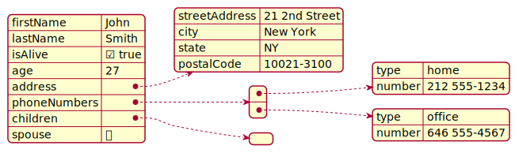

# plantuml-sample
A sample of using PlantUML in GitHub projects. Contains a custom theme, samples, and actions to render diagrams.

## Why?

Diagrams - UML, simple boxes and arrows, C4 - can massively increase understandability of software. Often, diagrams are maintained outside of the code base with specialized tools, which makes it a hassle to keep them up-to-date. I've seen outdated versions proliferate and cause confusion.
They are often stored in binary formats making it hard to see what exactly changed between versions.

Wouldn't it be nice if we could use code to create them, store them with our codebase, diff, and review them like any other source file. Turns out we can.

## How?

This repository contains a sample of how I currently to use it:

- some PlantUML samples
- a local theme
- a GitHub workflow to render diagrams and commit them
- this README embedding the rendered results

## Samples

## Further Reading

- [PlantUML website](https://plantuml.com/en/)
- [PlantUML reference](http://plantuml.com/en/guide)
- [Integrations](https://plantuml.com/en/running)
- [Blog post about PlantUML from jetbrains](https://blog.jetbrains.com/dotnet/2020/10/06/create-uml-diagrams-using-plantuml/)
- [C4 & PlantUML](https://github.com/plantuml-stdlib/C4-PlantUML)